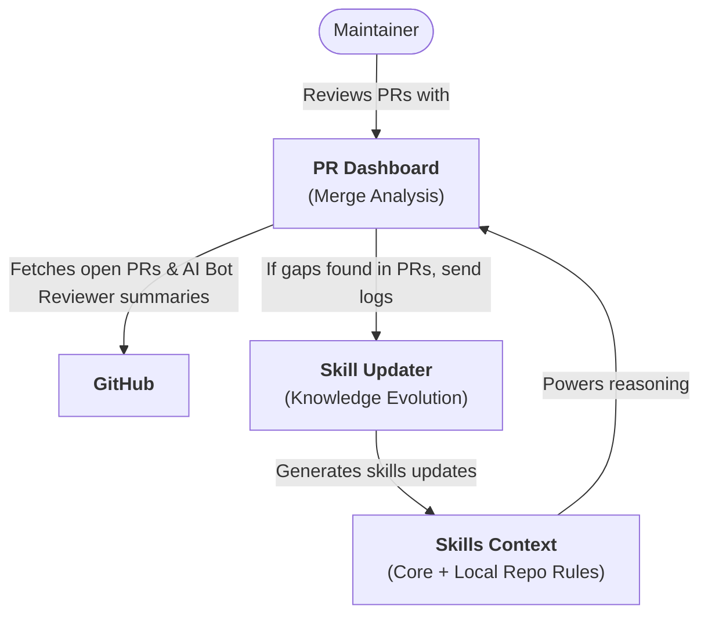

<!-- Don't delete it -->
<div name="readme-top"></div>

<!-- Organization Logo -->
<div align="center" style="display: flex; align-items: center; justify-content: center; gap: 16px;">
  
  
</div>

&nbsp;

<!-- Organization Name -->
<div align="center">

[](https://github.com/AOSSIE-Org/PullRequestDashboard)
<!-- Correct deployed url to be added -->

</div>

<!-- Organization/Project Social Handles -->
<p align="center">
<!-- Telegram -->
<a href="https://t.me/StabilityNexus">
</a>
&nbsp;&nbsp;
<!-- X (formerly Twitter) -->
<a href="https://x.com/aossie_org">
</a>
&nbsp;&nbsp;
<!-- Discord -->
<a href="https://discord.gg/hjUhu33uAn">
</a>
&nbsp;&nbsp;
<!-- LinkedIn -->
<a href="https://www.linkedin.com/company/aossie/">
  </a>
&nbsp;&nbsp;
<!-- Youtube -->
<a href="https://www.youtube.com/@AOSSIE-Org">
  </a>


[](https://scorecard.dev/viewer/?uri=github.com/AOSSIE-Org/PullRequestDashboard)

[](./BestPracticesChecklist.md)
</p>

---

<div align="center">
<h1>AOSSIE Pull Request Dashboard</h1>
<h3>Local-First Merge Analysis & Conflict Resolution Dashboard</h3>
</div>

**Pull Request Dashboard** (PR Dashboard) is a core module in the [AOSSIE Skills Ecosystem](https://github.com/AOSSIE-Org/skills). It is a local-first analysis tool designed to help project maintainers review incoming pull requests, identify semantic conflicts, analyze architectural gaps, and determine optimal merge sequences.

By querying the GitHub API via the GitHub CLI (`gh`), fetching PR diffs and automated AI Bot Reviewer (e.g., CodeRabbit, Devin) walkthrough summaries, loading codebase context (`context.md`), and calling local Ollama models, the tool generates a visual Conflict Directed Acyclic Graph (DAG) detailing merge reasoning and post-merge impacts.

---

## 🏗️ Role in the Skills Ecosystem

The PR Dashboard acts as the primary code quality and merge analysis layer for maintainers:



1. **Pull Request Fetching**: The dashboard connects to GitHub via `gh` to retrieve open/closed PRs, modified files, and AI Bot Reviewer (e.g., CodeRabbit, Devin) summaries.
2. **Context-Grounded Reasoning**: It reads the local repository context (`context.md`) and the global/per-repo skills from the Skills Core to evaluate PRs against the project rules.
3. **DAG Generation**: It renders an interactive Conflict DAG illustrating PR dependency relationships, suggested merge sequences, and post-merge impact.
4. **Gap Logging**: If the dashboard identifies any architectural gaps or changes not covered in the current skills context, it logs them to `gap_log.json` to be consumed by the [Skill Updater](https://github.com/kpj2006/skill-updater).

---

## 🚀 Key Features

* **Semantic PR Clustering**: Uses a local Ollama model to group and cluster PRs based on semantic similarity of code changes and modified subcomponents.
* **Conflict DAG Visualization**: Renders an interactive HTML report (`conflicts_tree.html`) detailing overlapping file conflicts, recommended merge sequences, and post-merge architectural impacts.
* **Isolated PR Filtering**: Identifies non-conflicting, independent PRs and lists them in `isolated_prs.html` for immediate, safe merging.
* **Local-First Analysis**: Executes all clustering, evaluation, and DAG reasoning locally through Ollama, ensuring data privacy with zero external API costs.
* **Feedback Loop Gap Signaling**: Emits gap events for the Skill Updater pipeline when developer PRs introduce architectural changes that are not documented in the skills.

---

## 💻 Tech Stack

* **CLI Integration**: GitHub CLI (`gh`)
* **Local Model Server**: Ollama (`qwen2.5:7b` / `llama3`)
* **Programming Language**: Python 3.10+
* **Report Rendering**: HTML5, Vanilla CSS, Tailwind CSS

---
## 🔗 Repository Links

1. [Skills Core Repository](https://github.com/AOSSIE-Org/Skills)
2. [Interactive Simulation](https://github.com/kpj2006/InteractiveSimulation) (Live Demo: [demo](https://kpj2006.github.io/InteractiveSimulation/))
3. [Skill Bot Assistant](https://github.com/AOSSIE-Org/SkillBot)
4. [Skill Updater Pipeline](https://github.com/kpj2006/skill-updater)


## 🏁 Getting Started

### Prerequisites

* **Python 3.10+**
* **Ollama** installed and running on your local machine.
* **GitHub CLI (`gh`)** installed and authenticated with your GitHub account:
  ```bash
  gh auth login
  ```

---

### Installation & Run

#### 1. Clone the Repository

```bash
git clone https://github.com/AOSSIE-Org/PullRequestDashboard.git
cd PullRequestDashboard
```

#### 2. Set Up Virtual Environment & Dependencies

**Windows (PowerShell):**

```powershell
python -m venv venv
.\venv\Scripts\Activate.ps1
pip install -r requirements.txt
```

**macOS / Linux:**

```bash
python -m venv venv
source venv/bin/activate
pip install -r requirements.txt
```

#### 3. Setup Context File

Ensure you have a `context.md` file detailing the repository architecture inside the dashboard folder (a default context file for [MiniChain](https://github.com/StabilityNexus/MiniChain) is provided as `context.md`).

#### 4. Configuration

All configuration settings are defined at the top of each script file—no `.env` file is required.

* **`github.py`** — Set the target repository:
  
  ```python
  REPO = "StabilityNexus/MiniChain"  # ← Change to your repository
  ```

* **`grouping.py`** — Tune the clustering sensitivity:
  
  ```python
  THRESHOLD = 0.55   # Lower value = more groups, higher value = fewer but tighter groups
  MIN_SIZE  = 2      # Minimum PRs needed to form a conflict group
  ```

* **`ollama.py`** — Choose the local LLM model:
  
  ```python
  OLLAMA_MODEL = "qwen2.5:7b"  # Specify the Ollama model to use
  ```

* **Switch to Production Mode (Open PRs)** in **`github.py`**:
  
  By default, the dashboard runs on recent closed PRs for testing. Switch to open PRs for production:
  
  ```python
  # Comment out the test line, and uncomment the production line:
  # prs = gh(f"repos/{REPO}/pulls?state=closed&per_page=10&sort=updated&direction=desc")
  return gh_paginate(f"repos/{REPO}/pulls?state=open&per_page=100")
  ```

#### 5. Run the Dashboard

Execute the entry point script:

```bash
python main.py
```

The script will fetch the PRs, cluster them, generate the reports, and automatically open them in your default web browser:
* `conflicts_tree.html` (Conflict DAG & merge sequencing)
* `isolated_prs.html` (Independent, ready-to-merge PRs)

---

## 🗺️ Roadmap & Future Enhancements

The long-term development of Pull Request Dashboard is divided into several milestones outlined in the [roadmap.md](./roadmap.md).

---

## 🛡️ Key Design Principles

1. **Context-Grounded**: Always evaluate PRs against the project description, architectural rules, and Skills Core.
2. **Merge Safety First**: Prioritize highlighting overlapping modifications and architectural conflict risks.
3. **Local-First**: Keep codebase analysis, clustering, and reasoning offline using local Ollama models.
4. **Actionable Recommendations**: Every conflict group must present a suggested merge order with clear reasoning.

---

## 🙌 Contributing

⭐ Don't forget to star this repository if you find it useful! ⭐

Thank you for considering contributing to this project! Contributions are highly appreciated and welcomed. To ensure smooth collaboration, please refer to our [Contribution Guidelines](./CONTRIBUTING.md).

---

## ✨ Maintainers

* [Karun Pacholi](https://github.com/kpj2006) - Lead Developer & Architect
* [zahnentferner](https://github.com/Zahnentferner) - admin & reviewer


---

## 📍 License

This project is licensed under the GNU General Public License v3.0.
See the [LICENSE](LICENSE) file for details.

---

## 💪 Thanks To All Contributors

Thanks a lot for spending your time helping TODO grow. Keep rocking 🥂

[](https://github.com/AOSSIE-Org/PullRequestDashboard/graphs/contributors)

© 2026 AOSSIE
